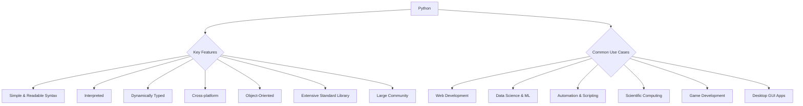

Python is a high-level, interpreted, general-purpose programming language. Created by Guido van Rossum and first released in 1991, Python's design philosophy emphasizes code readability with its notable use of significant indentation.

### Key Features of Python

*   **Simple and Readable Syntax:** Python's syntax is designed to be easy to read and write, resembling natural language more than other programming languages. This makes it an excellent choice for beginners.
*   **Interpreted Language:** Unlike compiled languages (like C++ or Java), Python code is executed line by line by an interpreter, which makes debugging easier and speeds up development.
*   **Dynamically Typed:** You don't need to declare the type of a variable when you create it. Python determines the type of data during runtime.
*   **Cross-platform:** Python runs on various operating systems, including Windows, macOS, and Linux.
*   **Object-Oriented:** Python fully supports object-oriented programming (OOP) principles, allowing for modular and reusable code.
*   **Extensive Standard Library:** Python comes with a vast collection of modules and packages, providing pre-written code for a wide range of tasks, from mathematical operations to network protocols.
*   **Large and Active Community:** A thriving community contributes to Python's ecosystem, providing support, libraries, and frameworks.

### Common Use Cases

Python's versatility makes it suitable for many applications:

*   **Web Development:** Frameworks like Django and Flask are popular for building robust web applications.
*   **Data Science and Machine Learning:** Libraries like NumPy, Pandas, Scikit-learn, TensorFlow, and PyTorch are cornerstones of data analysis, visualization, and AI development.
*   **Automation and Scripting:** Python is widely used for automating repetitive tasks, system administration, and creating utility scripts.
*   **Scientific and Numeric Computing:** Its simplicity and powerful libraries make it a favorite in scientific research and engineering.
*   **Game Development:** While not its primary strength, Python can be used for game development with libraries like Pygame.
*   **Desktop GUI Applications:** Tools like Tkinter, PyQt, and Kivy allow for the creation of desktop applications.

**Table: Python's Strengths and Weaknesses**

| Strength                    | Weakness                          |
| :-------------------------- | :-------------------------------- |
| Easy to learn and use       | Slower execution speed (interpreted) |
| Highly readable code        | High memory consumption (for some tasks) |
| Vast ecosystem of libraries | Not ideal for mobile development |
| Cross-platform compatibility | Global Interpreter Lock (GIL) limits true parallelism |
| Strong community support    |                                   |
