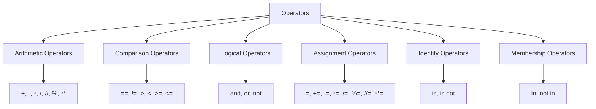

Operators are special symbols that perform operations on values and variables. These operations can be arithmetic calculations, comparisons, logical evaluations, or assignments. Understanding operators is fundamental to writing any functional Python code.

### Arithmetic Operators

These operators are used to perform mathematical calculations.

| Operator | Description      | Example        | Result |
| :------- | :--------------- | :------------- | :----- |
| `+`      | Addition         | `x + y`        | `Sum`  |
| `-`      | Subtraction      | `x - y`        | `Difference` |
| `*`      | Multiplication   | `x * y`        | `Product` |
| `/`      | Division         | `x / y`        | `Quotient (float)` |
| `//`     | Floor Division   | `x // y`       | `Quotient (int, discards fractional part)` |
| `%`      | Modulus          | `x % y`        | `Remainder` |
| `**`     | Exponentiation   | `x ** y`       | `x to the power of y` |

**Example:**

```python
a = 15
b = 4

print(f"a + b = {a + b}")    # Output: a + b = 19
print(f"a - b = {a - b}")    # Output: a - b = 11
print(f"a * b = {a * b}")    # Output: a * b = 60
print(f"a / b = {a / b}")    # Output: a / b = 3.75
print(f"a // b = {a // b}")  # Output: a // b = 3
print(f"a % b = {a % b}")    # Output: a % b = 3
print(f"a ** 2 = {a ** 2}")  # Output: a ** 2 = 225
```

### Comparison (Relational) Operators

These operators are used to compare two values and return a Boolean result (`True` or `False`).

| Operator | Description              | Example        | Result |
| :------- | :----------------------- | :------------- | :----- |
| `==`     | Equal to                 | `x == y`       | `True` if x equals y |
| `!=`     | Not equal to             | `x != y`       | `True` if x does not equal y |
| `>`      | Greater than             | `x > y`        | `True` if x is greater than y |
| `<`      | Less than                | `x < y`        | `True` if x is less than y |
| `>=`     | Greater than or equal to | `x >= y`       | `True` if x is greater than or equal to y |
| `<=`     | Less than or equal to    | `x <= y`       | `True` if x is less than or equal to y |

**Example:**

```python
x = 10
y = 12

print(f"x == y: {x == y}")   # Output: x == y: False
print(f"x != y: {x != y}")   # Output: x != y: True
print(f"x > y: {x > y}")     # Output: x > y: False
print(f"x < y: {x < y}")     # Output: x < y: True
print(f"x >= 10: {x >= 10}") # Output: x >= 10: True
print(f"y <= 10: {y <= 10}") # Output: y <= 10: False
```

### Logical Operators

As covered in the previous section, logical operators combine conditional statements.

| Operator | Description                                             | Example                        |
| :------- | :------------------------------------------------------ | :----------------------------- |
| `and`    | Returns `True` if both statements are true              | `x < 5 and x < 10`             |
| `or`     | Returns `True` if one of the statements is true         | `x < 5 or x < 4`               |
| `not`    | Reverses the result, returns `False` if the result is true | `not(x < 5 and x < 10)`        |

**Example:**

```python
age = 25
has_license = True

if age >= 18 and has_license:
    print("Eligible to drive.")
else:
    print("Not eligible to drive.")
```

### Assignment Operators

Assignment operators are used to assign values to variables.

| Operator | Example      | Same As      |
| :------- | :----------- | :----------- |
| `=`      | `x = 5`      | `x = 5`      |
| `+=`     | `x += 3`     | `x = x + 3`  |
| `-=`     | `x -= 3`     | `x = x - 3`  |
| `*=`     | `x *= 3`     | `x = x * 3`  |
| `/=`     | `x /= 3`     | `x = x / 3`  |
| `%=`     | `x %= 3`     | `x = x % 3`  |
| `//=`    | `x //= 3`    | `x = x // 3` |
| `**=`    | `x **= 3`    | `x = x ** 3` |

**Example:**

```python
count = 10
count += 5  # Equivalent to count = count + 5
print(count) # Output: 15

value = 100
value /= 2  # Equivalent to value = value / 2
print(value) # Output: 50.0
```

### Identity Operators

Identity operators are used to compare the memory locations of two objects.

| Operator | Description                                        | Example      |
| :------- | :------------------------------------------------- | :----------- |
| `is`     | Returns `True` if both variables are the same object | `x is y`     |
| `is not` | Returns `True` if both variables are not the same object | `x is not y` |

**Example:**

```python
list1 = [1, 2, 3]
list2 = [1, 2, 3]
list3 = list1

print(f"list1 is list2: {list1 is list2}")   # Output: False (different memory locations)
print(f"list1 == list2: {list1 == list2}")   # Output: True (same content)
print(f"list1 is list3: {list1 is list3}")   # Output: True (list3 points to the same object as list1)
```

### Membership Operators

Membership operators are used to test if a sequence (like strings, lists, tuples) contains a specific value.

| Operator | Description                                      | Example     |
| :------- | :----------------------------------------------- | :---------- |
| `in`     | Returns `True` if a value is found in the sequence | `x in y`    |
| `not in` | Returns `True` if a value is not found in the sequence | `x not in y`|

**Example:**

```python
my_string = "hello world"
my_list = [10, 20, 30]

print(f"'hello' in my_string: {'hello' in my_string}")   # Output: 'hello' in my_string: True
print(f"50 not in my_list: {50 not in my_list}")         # Output: 50 not in my_list: True
```


