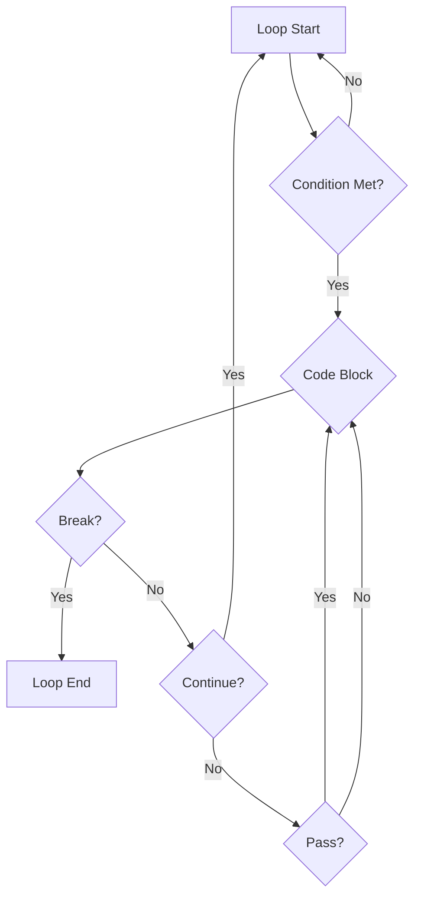
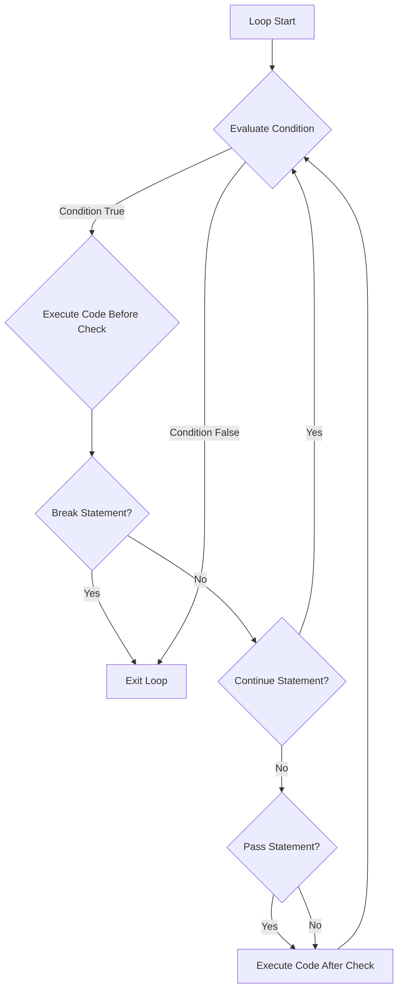

Python provides special statements that allow you to alter the normal flow of loops: `break`, `continue`, and `pass`. These keywords give you finer control over when a loop terminates or when an iteration is skipped.

### The `break` Statement

The `break` statement is used to terminate the loop entirely. When `break` is encountered, the loop is immediately exited, and program execution continues with the statement immediately following the loop.

**Use Case:** Exiting a loop when a specific condition is met, even if the loop's natural end hasn't been reached.

**Example:**

```python
for i in range(1, 10):
    if i == 5:
        print("Breaking loop at 5")
        break  # Exit the loop entirely
    print(f"Current number: {i}")

print("Loop finished.")

# Output:
# Current number: 1
# Current number: 2
# Current number: 3
# Current number: 4
# Breaking loop at 5
# Loop finished.
```

In a `while` loop:

```python
count = 0
while True:
    print(f"Count: {count}")
    count += 1
    if count >= 3:
        print("Time to break out!")
        break
print("Loop terminated.")

# Output:
# Count: 0
# Count: 1
# Count: 2
# Time to break out!
# Loop terminated.
```

### The `continue` Statement

The `continue` statement is used to skip the rest of the current iteration of the loop and move to the next iteration. The loop does not terminate; it just bypasses the remaining code in the current pass.

**Use Case:** Skipping specific items or conditions within a loop without stopping the entire loop.

**Example:**

```python
for i in range(1, 6):
    if i % 2 == 0:  # If i is an even number
        print(f"Skipping even number: {i}")
        continue  # Skip the rest of this iteration
    print(f"Current odd number: {i}")

print("Loop finished.")

# Output:
# Current odd number: 1
# Skipping even number: 2
# Current odd number: 3
# Skipping even number: 4
# Current odd number: 5
# Loop finished.
```

### The `pass` Statement

The `pass` statement is a null operation; nothing happens when it executes. It's a placeholder. It is useful when you syntactically require some code, but you don't want any command or code to execute.

**Use Case:**

1.  **Placeholder for future code:** In functions, classes, or loops that you haven't implemented yet, to avoid `IndentationError`.
2.  **Minimal classes/functions:** To create minimal classes or functions without any behavior.

**Example:**

```python
# Function that does nothing (yet)
def coming_soon_function():
    pass

# Class that does nothing (yet)
class EmptyClass:
    pass

# Loop with a placeholder
for letter in "Python":
    if letter == 't':
        pass  # Do nothing for 't', just continue normally
    else:
        print(letter)

# Output:
# P
# y
# h
# o
# n
```

| Statement | Action                                       | Effect on Loop          |
| :-------- | :------------------------------------------- | :---------------------- |
| `break`   | Terminates the loop                          | Loop ends               |
| `continue`| Skips the rest of the current iteration      | Continues to next iteration |
| `pass`    | Does nothing; a null operation               | Loop continues normally |


*(Self-correction: The flowchart for `pass` should show it leading back to the loop processing, not just the code block, as it effectively just lets the iteration continue. The current diagram for pass is slightly off, but illustrates the *idea* of 'do nothing here'.)*

(Revised flowchart for clarity and accuracy regarding `pass`)