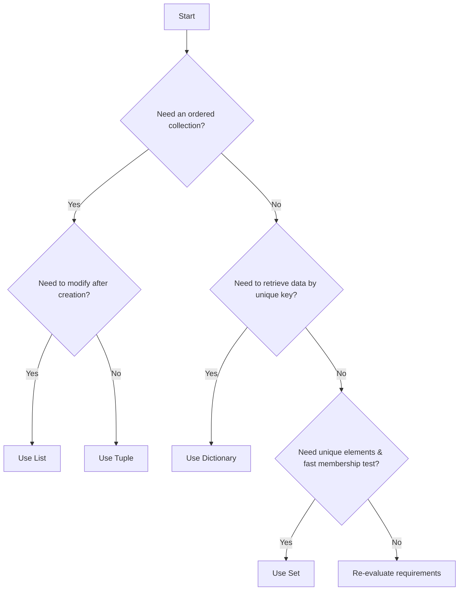

With Python's powerful built-in data structures—Lists, Tuples, Dictionaries, and Sets—it's crucial to understand when to use each one effectively. Choosing the right data structure can significantly impact your code's performance, readability, and maintainability.

### Decision Criteria

Consider the following questions when deciding which data structure to use:

1.  **Is the data ordered?** Do you need to maintain the insertion order or access elements by their position (index)?
2.  **Is the data mutable?** Do you need to modify, add, or remove elements after creation?
3.  **Are duplicate values allowed?** Can the collection contain the same item multiple times?
4.  **How will you access the data?** By index, by a unique key, or by checking for membership?

### Summary of Python's Core Data Structures

| Feature / Data Type | List (`[]`)           | Tuple (`()`)          | Dictionary (`{key: value}`) | Set (`{element}`)         |
| :------------------ | :-------------------- | :-------------------- | :-------------------------- | :------------------------ |
| **Ordered?**        | Yes (insertion order) | Yes (insertion order) | Yes (Python 3.7+ insertion order) | No                        |
| **Mutable?**        | Yes                   | No                    | Yes                         | Yes                       |
| **Allows Duplicates?**| Yes                   | Yes                   | No (keys must be unique, values can be duplicated) | No                        |
| **Indexed?**        | Yes (by integer)      | Yes (by integer)      | No (accessed by key)        | No                        |
| **Use Case**        | General-purpose collections, ordered sequences, stacks, queues | Fixed collections, function return values, dictionary keys | Key-value mapping, representing objects/records | Unique collections, membership testing, mathematical set operations |
| **Syntax**          | `[1, 2, 3]`           | `(1, 2, 3)`           | `{"a": 1, "b": 2}`          | `{1, 2, 3}` (for non-empty) `set()` (for empty) |

### When to Use Which?

#### Use a **List** when:

*   You need an ordered collection of items.
*   The collection might change (add, remove, modify elements).
*   You need to access items by index.
*   You want to allow duplicate items.
    *   **Examples:** A sequence of user inputs, a list of tasks in a to-do app, a collection of items in a shopping cart.

#### Use a **Tuple** when:

*   You need an ordered collection of items that should *not* change.
*   The data represents a fixed group of related values (e.g., coordinates, RGB colors).
*   You need to use the collection as a key in a dictionary (because of immutability).
*   Your function returns multiple values.
    *   **Examples:** Geographic coordinates `(latitude, longitude)`, dates `(year, month, day)`, database records, configuration settings.

#### Use a **Dictionary** when:

*   You need to store data in key-value pairs.
*   You need to retrieve values quickly using a unique key.
*   You want to represent objects or records with named attributes.
*   The order of items is not critical (or only insertion order is needed for Python 3.7+).
    *   **Examples:** User profiles (`{"username": "alice", "email": "a@example.com"}`), configuration files, mapping IDs to names.

#### Use a **Set** when:

*   You need a collection of unique items.
*   The order of items is not important.
*   You need to perform mathematical set operations (union, intersection, difference).
*   You need fast membership testing (`in` operator).
    *   **Examples:** Storing a list of unique tags, finding common elements between two groups, checking if an item exists in a large collection efficiently.

By carefully considering these characteristics and typical use cases, you can select the most appropriate data structure, leading to more efficient, robust, and Pythonic code.