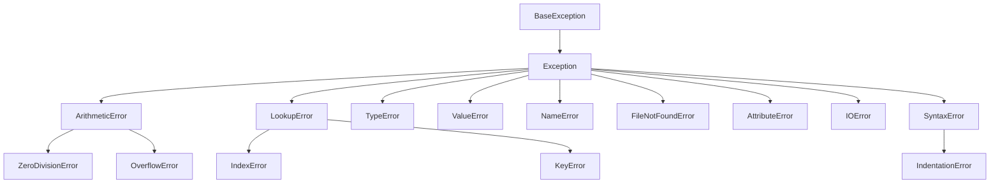

In Python, an **exception** is an event that occurs during the execution of a program that disrupts the normal flow of instruction execution. When a Python script encounters a situation that it cannot cope with, it raises an exception. An exception is a Python object that represents an error.

### Errors vs. Exceptions

It's important to distinguish between syntax errors and exceptions.

*   **Syntax Errors (Parsing Errors):** These occur when the parser detects an incorrect statement. They prevent the program from even starting. Python will tell you where the error occurred and won't run.

    ```python
    # Example of a SyntaxError
    # if x > 10
    #     print("x is large")
    # Missing colon will cause a SyntaxError
    ```

*   **Exceptions:** These occur *during* the execution of the program, even if the syntax is correct. Python tries to execute the code, but something goes wrong at runtime.

    ```python
    # Example of an Exception (ZeroDivisionError)
    # print(10 / 0)
    # Output: ZeroDivisionError: division by zero

    # Example of an Exception (NameError)
    # print(undefined_variable)
    # Output: NameError: name 'undefined_variable' is not defined

    # Example of an Exception (TypeError)
    # "hello" + 5
    # Output: TypeError: can only concatenate str (not "int") to str
    ```

### Common Built-in Exceptions

Python has a hierarchy of built-in exception types to indicate various kinds of errors. Here are some common ones:

*   **`ZeroDivisionError`**: Raised when division or modulo by zero takes place.
*   **`NameError`**: Raised when a local or global name is not found.
*   **`TypeError`**: Raised when an operation or function is applied to an object of inappropriate type.
*   **`ValueError`**: Raised when an operation or function receives an argument that has the right type but an inappropriate value.
*   **`IndexError`**: Raised when a sequence subscript (index) is out of range.
*   **`KeyError`**: Raised when a dictionary key is not found.
*   **`FileNotFoundError`**: Raised when a file or directory is requested but doesn't exist.
*   **`AttributeError`**: Raised when an attribute reference or assignment fails.
*   **`IOError`**: Raised when an I/O operation (like `open()` or `read()`) fails for an OS-related reason.
*   **`IndentationError`**: Raised when there is incorrect indentation. (This is technically a subclass of `SyntaxError` but occurs specifically due to whitespace issues).

You can find a comprehensive list in the [official Python documentation](https://docs.python.org/3/library/exceptions.html).

### The Exception Hierarchy

All built-in exceptions in Python inherit from the `BaseException` class. A common superclass for non-fatal errors is `Exception`. Understanding this hierarchy is useful for catching groups of related exceptions.



### The Importance of Exception Handling

Ignoring exceptions can lead to programs crashing unexpectedly, resulting in a poor user experience and potential data loss. Proper exception handling allows your program to:

*   **Gracefully Recover:** Continue execution even after an error, perhaps by retrying an operation or providing a fallback.
*   **Provide User Feedback:** Inform the user about what went wrong in a clear, understandable way.
*   **Log Errors:** Record detailed information about the error for debugging and maintenance.
*   **Maintain Program Stability:** Prevent the entire application from crashing due to a single fault.

In the next section, we will learn how to handle these exceptions using `try`, `except`, `else`, and `finally` blocks.